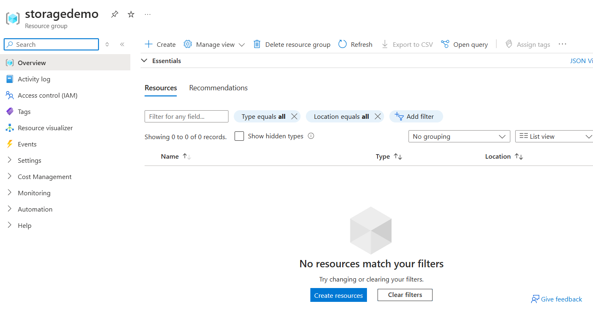
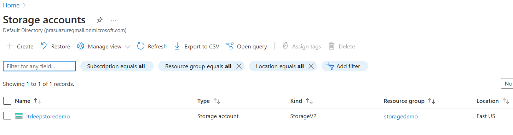
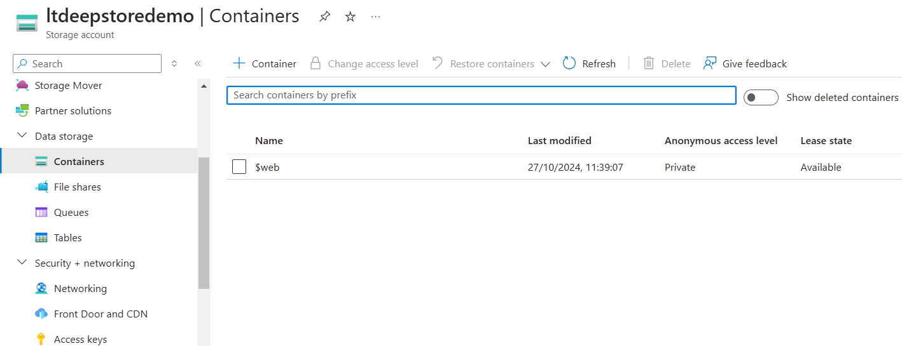
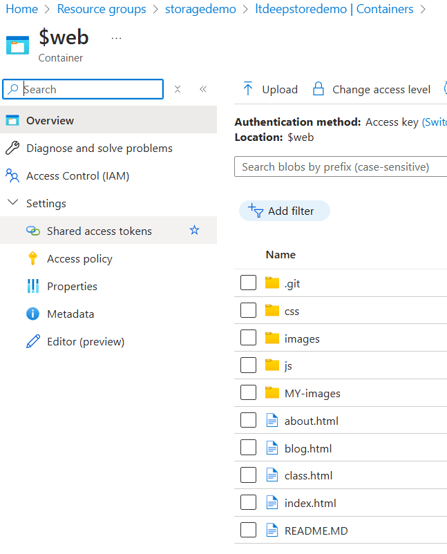
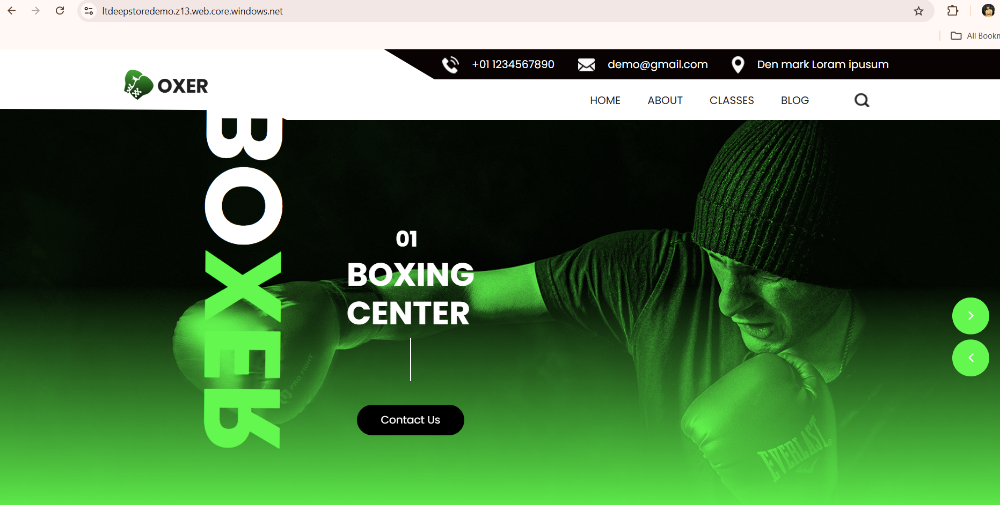

# Azure Blob Storage Static Website Setup
This document outlines the steps to configure a static website on Azure Blob Storage using the provided template files from oxer.zip
Prerequisites
#### 1) Azure CLI installed on your machine.
#### 2) An Azure account with appropriate permissions.
#### 3) oxer.zip template downloaded.

### Steps to be followed

### 1. Ensure You're Logged Into Azure

Log into your Azure account using the following command:
```bash
az login
```

### 2. Create a Resource Group 
Create a new resource group to hold your storage account:
```bash
az group create \
    --name "storagedemo" \
    --location "eastus"
```


### 3. Create a Storage Account
Create a new storage account with the desired configurations:
```bash
az storage account create \
  --name ltdeepstoredemo \
  --resource-group storagedemo \
  --location eastus \
  --sku Standard_RAGRS \
  --kind StorageV2 \
  --min-tls-version TLS1_2 \
  --allow-blob-public-access true
```


### 4. Create a Storage Container
Create a container in the storage account where your blobs will be stored:
```bash
az storage container create \
  --name \$web \
  --account-name ltdeepstoredemo
```


### 5. Enable Static Website Hosting
Set up the storage account to serve as a static website:
```bash
az storage blob service-properties update \
  --account-name ltdeepstoredemo \
  --static-website true \
  --index-document index.html \
  --404-document 404.html
```

### 6. Upload Template Files
Navigate to the template directory and upload the files to the $web container:
```bash
az storage blob upload-batch \
  --destination '$web' \
  --source . \
  --account-name ltdeepstoredemo
```


### 7. Get the Static Website URL
Retrieve the URL of the static website:
```bash
staticWebsiteUrl=$(az storage account show \
  --name ltdeepstoredemo \
  --query "primaryEndpoints.web" \
  --output tsv)
```

### 8. Access the Website
Open the retrieved URL in your browser to view the deployed site.
```bash
 echo "Static Website URL: $staticWebsiteUrl"
```


## Conclusion
You have successfully set up a static website on Azure Blob Storage using the oxer template.
